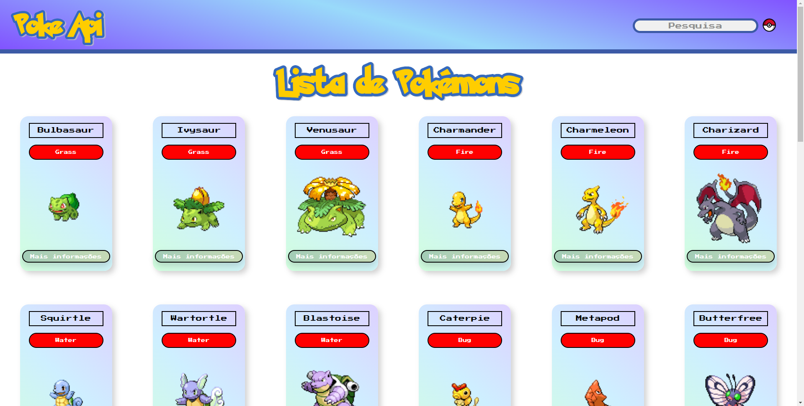

# Pokédex em Angular consumindo a [PokéAPI](https://pokeapi.co/)




* [Angular CLI 14.2.6](https://angular.io/)
* [PokéAPI](https://pokeapi.co/)
* [Angular Material](https://material.angular.io/)
* [Repositório](https://github.com/christyanbrayan/pokedex-deploy) com deploy no GitHub Pages
* [Wireframe](https://www.figma.com/file/uvWIVyF2wmXdoqJ4vxERD3/Wireframe---Mini-Projeto-Estagi%C3%A1rios?node-id=0%3A1)

## Rodando

* Necessário [Node.js](https://nodejs.org/) e NPM instalados.

Clone o projeto, entre na pasta e instale as dependências:
```
npm install
```

E rode o projeto:
```
ng serve
```

Acesse em [localhost:4200](http://localhost:4200/)

---

Desenvolvido por [Christyan Brayan](https://github.com/christyanbrayan) e [João Paulo](https://github.com/kirakman) durante estágio no [Instituto Eldorado](https://www.eldorado.org.br/)
